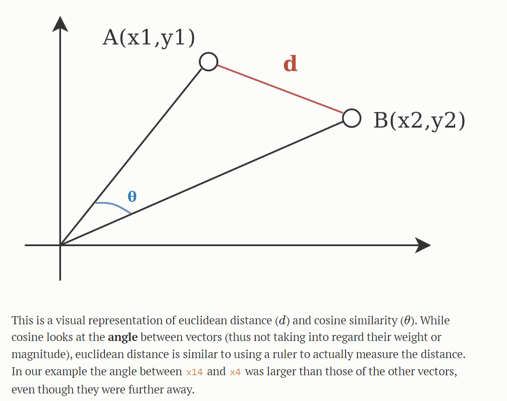

# Vector Database

## What is a vector database?

A vector database is a collection of data stored as vectors, which are mathematical representations of data points in a graph. These vectors encode the essential features of the data items in a numerical format, facilitating various computational operations and analyses.

It is commonly used in various cases like recommendation systems, image/video searching and machine learning.

## Storage 

The database is composed of at least 3 elements:

- Id: A unique identifier assigned to each data item in the database
- Data: The actual content or item being stored in the database
- Vector: Numerical representations of the data items, obtained through the use of embedding models (piece of code using various machine learning algorithms to get coherent vectors from items)

## Use case

A vector database finds applications in various domains, including:

- **Recommendation Systems:** By representing users and items as vectors, recommendation algorithms can efficiently compute similarities between users' preferences and recommend relevant items
- **Image and Video Searching:** Vectors representing visual content enable similarity-based search algorithms to retrieve images or videos similar to a given query, facilitating content-based retrieval and recommendation
- **Machine Learning:** Vector databases serve as the underlying storage for machine learning models, enabling efficient training and inference processes. The numerical representations of data facilitate tasks such as classification, regression, clustering, and anomaly detection

## Querying

The queries in the database are done through different similarity measures. There are different measures :

- **Cosine similarity** : The measure will be between -1 and 1. It measures the angle of the 2 or more points from the point of origin. It is mainly use in a text database because if you have a long text and a short one, the long text won't have a bigger impact on the result
- **Euclidean distance** : Measures the distance between two points from 0 to infinity

