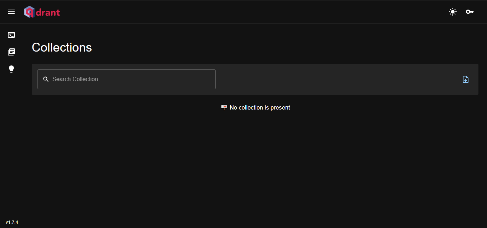
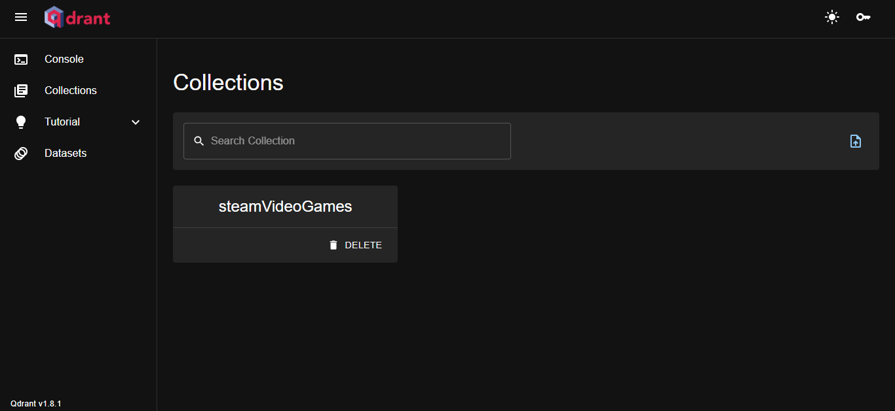
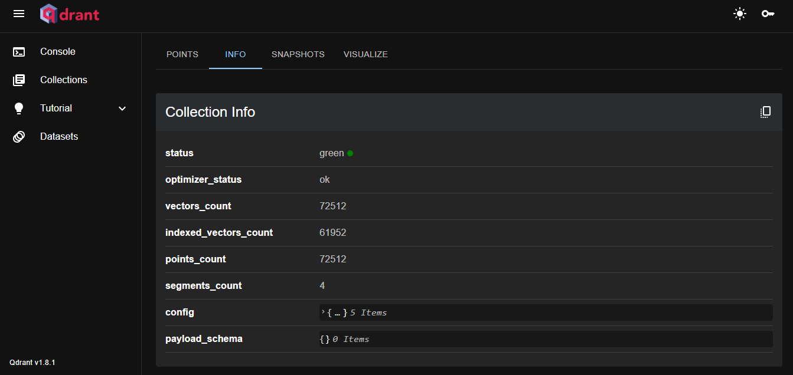
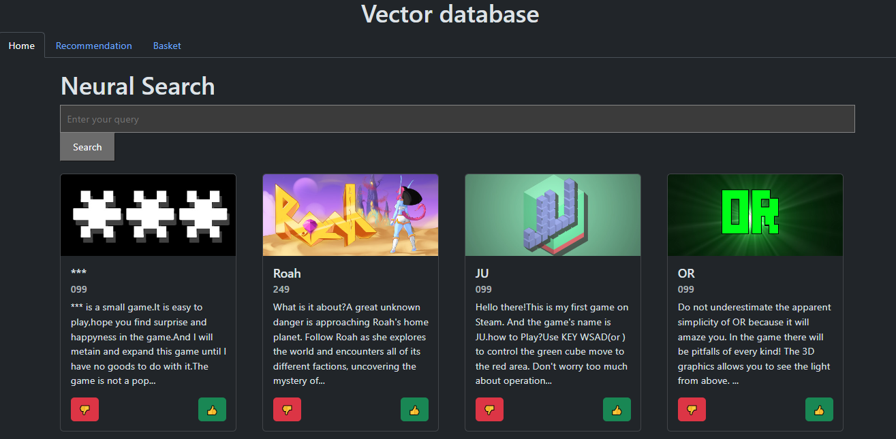
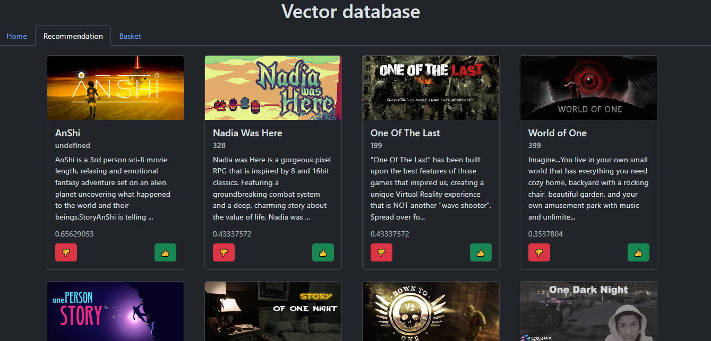

# Vector Database (and AI prompt?)
by Henriques Amaral Guilherme Filipe, Schneider Bastien, Salamin Alexandre


## Description of the project

This project focuses on developing a high-performance vector database, leveraging Qdrant for efficient indexing and retrieval of vector data.

For our project, we decided to do a recommendation of games based on the steam collection until 2019. With Qdrant, it will provide a solution for our project thanks to his rapid and accurate processing.

We will mainly focus on the explanation of how vector database work and compare it to other solution.

## Step-by-step installation
You can find the extended version in the [qdrant website](https://qdrant.tech/).

## Requirement

 - [Docker Desktop](https://www.docker.com/products/docker-desktop/)
 - [Python](https://www.python.org/downloads/)
 - Python client (Like [VS code](https://code.visualstudio.com/download), [Intellij](https://www.jetbrains.com/idea/download/?section=windows),...)

##  Starting the Qdrant docker

1. Have all the requirement installed
2. Install the Qdrant docker (via the command prompt for example)
```docker pull qdrant/qdrant```
3. Run the docker
``docker run -p 6333:6333 qdrant/qdrant``
4. You can access to the website UI of the [docker](http://localhost:6333/dashboard)

5. Now you can access everytime to the UI pannel. Don't forget to always run the docker before going to the website.

## Setup

Install the needed packages via the [requirements.txt](requirements.txt)

### Preparation and uploading of the dataset/collection

You can create your own dataset manually by following this [guide](https://qdrant.tech/documentation/quick-start/#create-a-collection), but for our project we decided to find a dataset online already made, for exemple, in [kaggle](https://www.kaggle.com/datasets)

The dataset we choose is the [steam dataset](https://www.kaggle.com/datasets/deepann/80000-steam-games-dataset?resource=download) and it gives us a .csv and a .json. We extract the .json and put it in ``Data/RawData`` then we run the code [datasetPreparation.py](Code/datasetPreparation.py) (make sure to do the necessary path correction). Once the code is finalized, make sure to run the qdrant docker before continuing.

Next, we need to upload the dataset in the vector database and to do that, we gonna run the code [uploadToDb.py](Code/uploadToDb.py).

Once the code is finally done, we can check if our database exist on the [Qdrant UI](http://localhost:6333/dashboard#/collections) and as we can see, our dataset is complete.
 

### Test the research

Once the preparation and the uploading of the dataset is complete, we gonna test the search to find similarities between each vectors.

To do that, we're going to run the [service.py](Code/service.py) and when the application start is complete, then run the [index.html](static/index.html). Normally, your gonna land on this site : 

If we try to search a game, for exemple, Grand Theft Auto, we have this results : 

--- add rest here

## Error handling
We cross against some errors during the development of this project :

1. qdrant_client.http.exceptions.ResponseHandlingException: timed out

This error can be solved by adding a timeout, exemple:
``
client = QdrantClient(
    "localhost",
    port=6333,
    timeout=60
)
``

2. AttributeError: module 'httpcore' has no attribute 'CloseError'

This error is a problem of package, be sure to install the correct version of packages in the requirements (no version = latest version)

3.